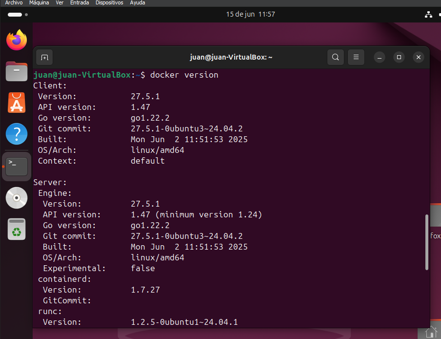
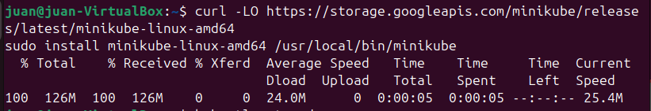
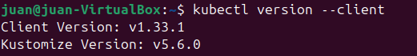
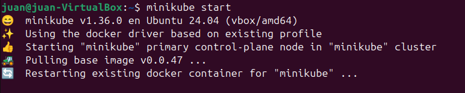
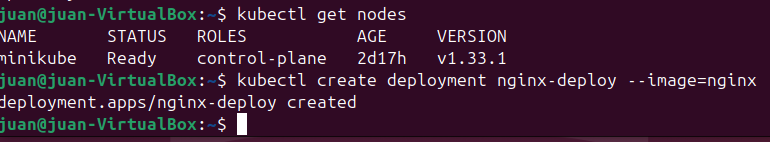
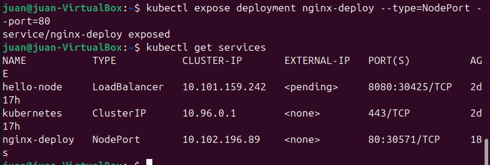
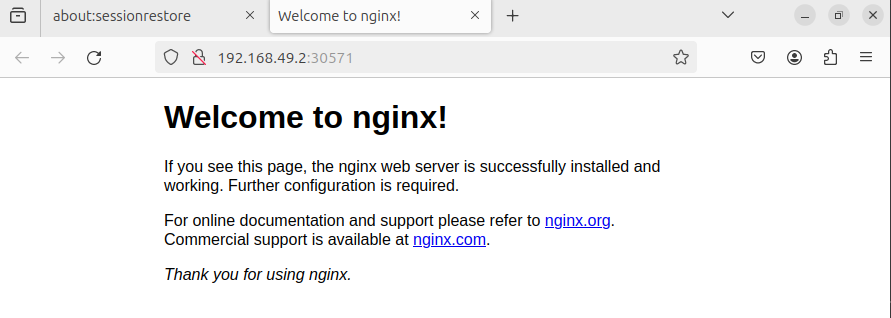
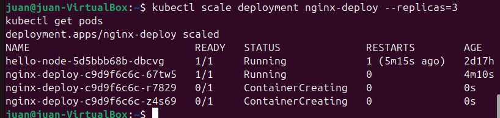
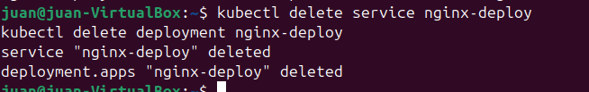

## Preparación del entorno
### Instalación docker

### Instalación Minikube

### Instalación kubectl

### Iniciar minikube

## desplegar tu primera aplicación

### Deployment creado

### Exponer el servicio

### Acceder a la aplicación

## Escalar la aplicación

## Eliminar todo

