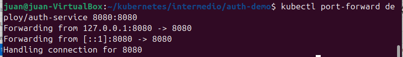

## Crear un deployment y un service en YAML

## Externalizar configuraciones con ConfigMap

## Manejar información sensible con Secrets

## Montar archivos como volúmenes

## Limpieza de los recursos

## Despliegue de multiples servicios

